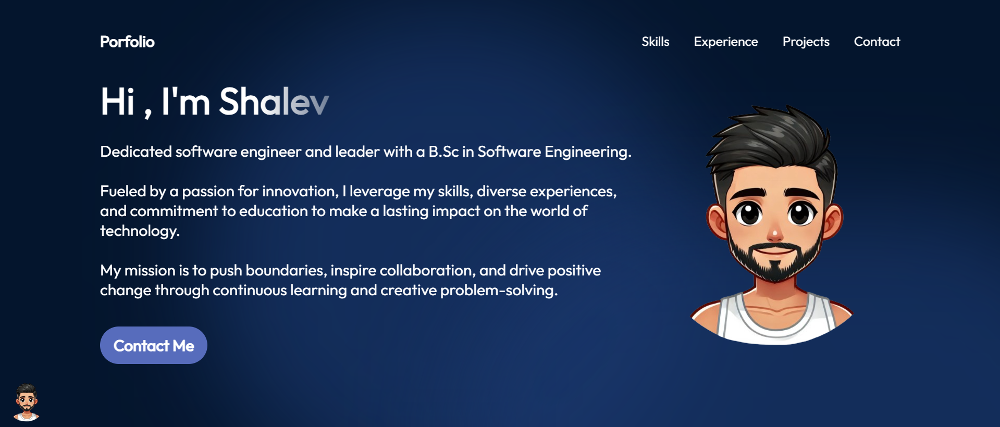
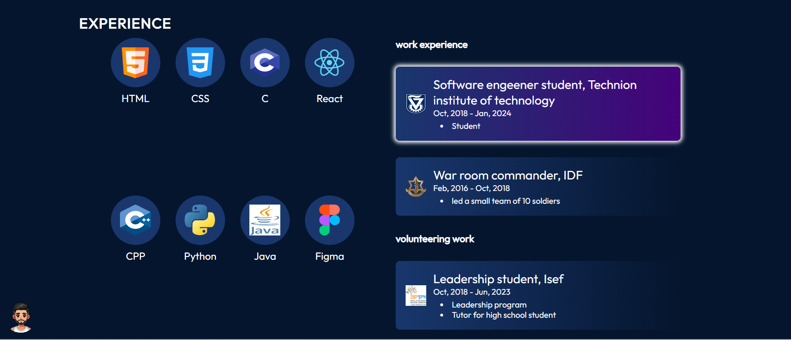
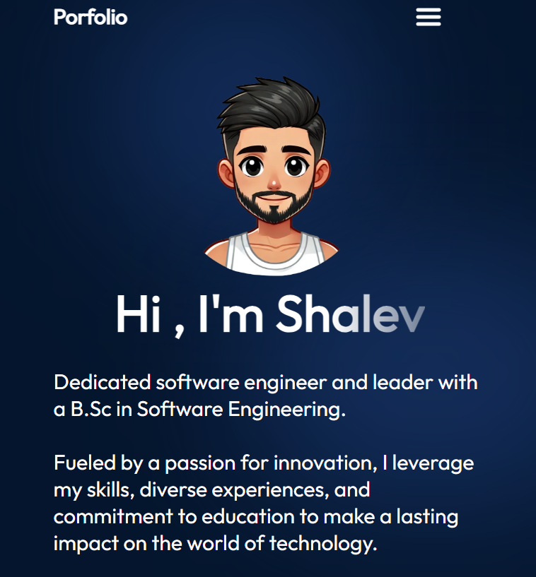
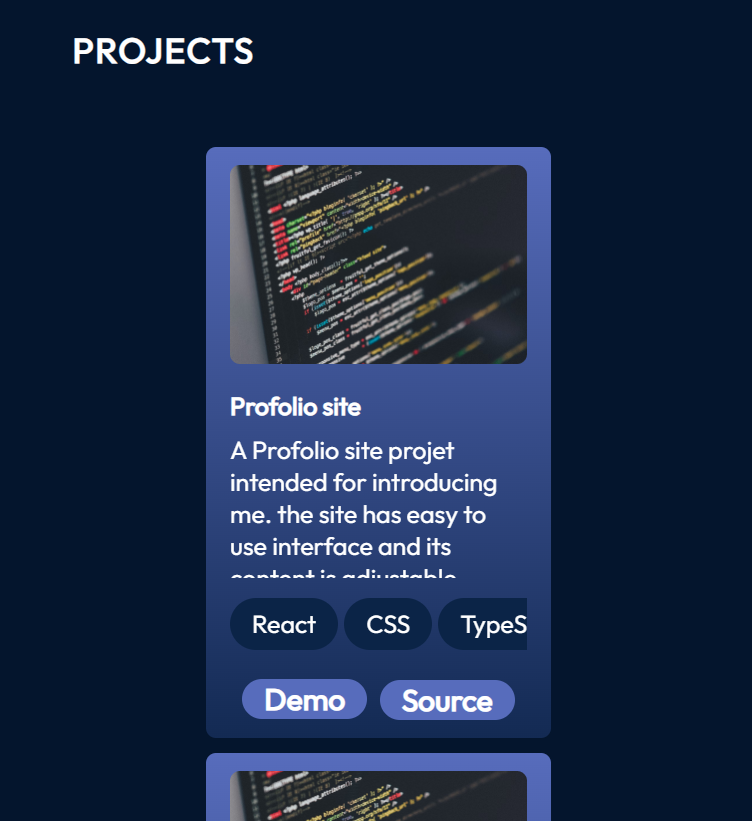

# React + TypeScript + Vite cv site for users

The project will allow you to create a cv site that is costumed for you with a simple Json file edit.

## computer screen example

  
  

## phone screen example

  
  

# Costumization

the folder src/data contains 5 different Json files that are used to costumize the site to fit your experiences and contact information

- ### user.json

  the file user json contains the following field to be filled by you:
  contact information,
  the "about me" section of the cv ,
  a floating image (Can be given by adding the image file to the files in the site or by gibing it a URL),

  a list of professional skills and proffesions for the user (in order to show the page you have to remove it as a comment in the App.tsx page)

  a list of skills to be added and shown in its own section
  a list of languages the user speaks

- ### history.json

  a list of previous workplaces and professions

- ### projects.json

  a list of previous projects of the user, their descriptions and links for github or demos

- ### volenteering.json

  a list of previous volenteer works of the user

- ### skills.json
  a list of the user's skills

A user can change the order of the pages shown and can remove them by changing the "App.tsx" file
and can change Colors by changing the values in the file "vars.css"

the code used the concept and info from the following project code:

- https://github.com/CodeCompleteYT/react-portfolio
